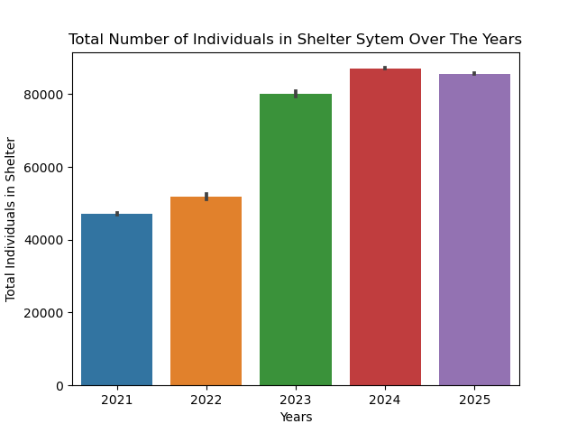
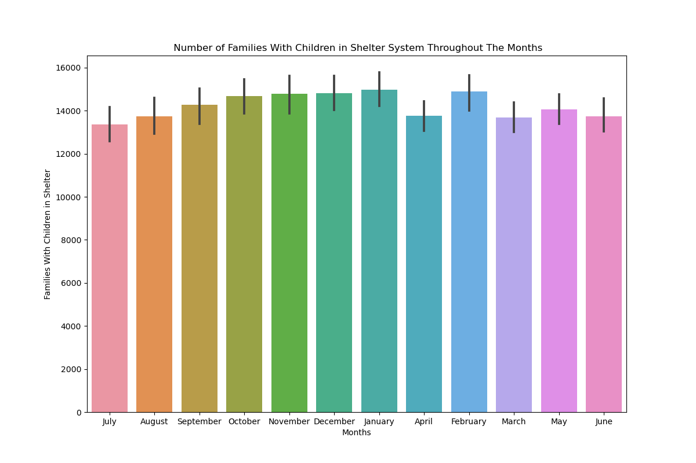

# DHS-Daily-Report

## Problem Statement 
-DHS is The Department of Homeless Services, a New York City agency focused on preventing and addressing homelessness. It works to help individuals and families find and maintain stable housing, providing services like shelter and case management. This dataset includes the daily number of families and individuals residing in the Department of Homeless Services (DHS) shelter system and the daily number of families applying to the DHS shelter system. This dataset includes data starting from 01/03/2021 and was provided by NYC Open Data taken from th NYC Department of Social Services. 

-The purpose of this analysis is to look at how many people are in the NYC shelter system and to identify any trends or patterns that are found and to understand what contributed to these patterns. Given this information we can learn around what time of the year or what months are more families entering the shelter system as well as when are less families entering the shelter system. this can also provide insight on how many individual people are in the shelter from single adults to just children. 

## Data Dictionary
Include a data dictionary to explain the meaning of each variable or field in the dataset.

Column Name                                                                   Description                                                                         API Field Name                                         Data Type    
-------------------------------------------------------------------------------------------------------------------------------------------------------------------------------------------------------------------------------------
-Date of Census                                                            Date of the census                                                                     date_of_census                                    Floating Timestamp

-Total Adults in Shelter                                       The number of adults in shelter as of the date of census                                           total_adults_in_shelter                                 Number

-Total Children in Shelter                                     The number of children in shelter as of the date of census                                         total_children_in_shelter                               Number

-Total Individuals in Shelter                                  The number of persons in shelter as of the date of census                                          total_individuals_in_shelter                            Number

-Single Adult Men in Shelter                                   Total number of single adult men in shelter as of date of census                                   single_adult_men_in_shelter                             Number

-Single Adult Women in Shelter                                 Total number of single adult women in shelter as of date of census                                 single_adult_women_in_shelter                           Number

-Total Single Adults in Shelter                                The number of single adult men and women in shelter as of the date of census                       total_single_adults_in_shelter                          Number

-Families w/ Children in Shelter                               Total number of families with children in shelter as of date of census                             families_with_children_in_shelter                       Number

-Adults in Families w/Children                                 Total number of adults in family w/ children in shelter as of date of census                       adults_in_families_with_children_in_shelter             Number

-Children in Families w/ Children                              Total number of children in family w/ children in shelter as of date of census                     children_in_families_with_children_in_shelter           Number

-Total Individuals in Families w/ Children in Shelter          Total number of individuals in families with children in shelter as of date of census              total_individuals_in_families_with_children_in_shelter  Number

-Adult Families in Shelter                                     Total number of adult families in shelter as of date of census                                     adult_families_in_shelter                               Number

-Individuals in Adult Families in Shelter                      Total number of individuals in adult families in shelter as of date of census                      individuals_in_adult_families_in_shelter                Number

## Executive Summary

### Data Cleaning Steps
While viewing the data I noticed there was a date column which contained the month, day of the month and year in number form. Since I wanted to complete analysis for each of these I created a function that extracted the month, day of the month and year and created a column for Month, Year and Day of Week using (dt) datetime functions. This changed the dtypes for month and day of week to objects making it easier to use within my analysis.

### Key Visualizations
Include key visualizations that highlight important aspects of the data. Use graphs, charts, or any other visual representation to make your points.

#### Visualization 1: ['Total Number of Individuals in Shelter Sytem Over The Years']
[This bar graph is consistent with the previous two graphs which displays an increase in people in shelter system over the years from 2021 to 2025.]

#### Visualization 2: ['Number of Families With Children in Shelter System Throughout The Months']
[There is a drop in families with children coming into the shelter system between April and June.]

## Conclusions/Recommendations
Based on the analysis there has been an increase in individuas entering the shelter system between 2023 and 2025. We see this in both visualizations for total adults and total children. This can be due to the large influx of asylum seekers and a housing affordability crisis, worsened by the expiration of pandemic-era support programs.

## Additional Information
I beleive having more information such as how many male and female children reside in the shelter system as well as having a nonbinary option for gender as well knowing the exact ages of each individual in the system. I think it would also be helful to know where these individuals came from or previously resided. Given this information we can look into what is going on there and what can be done to help them. 